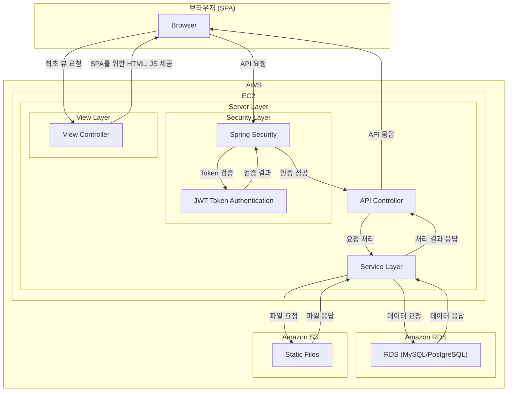

---
# SoundBrew  
> **회원/구독제 음원 판매 사이트**
---
## 프로젝트 소개
"내가 만든 음원을 손쉽게 찾고, 간편하게 업로드하고, 사람들에게 들려줄 수 있다면?"

단순한 아이디어에서 프로젝트가 시작되었습니다.  
팀원 전원이 **실용음악과 출신**으로, 직접 **음원 공유 사이트를 만들어 보고 싶다**는 목표를 가지고 주제를 선정했습니다.  

이 프로젝트에서는 **RESTful API를 최대한 준수**하여,  
- **서버는 API 제공에 집중**하고 **클라이언트는 UI 렌더링을 전담**하는 **SPA 방식**을 채택하고,
- 이를 기반으로 **백엔드**와 **프론트엔드**의 개발 분리를 통해 **효율성**을 핵심으로 삼았습니다 <br><br>
또한 다음과 같은 기능을 추가하여 실용성과 확장성을 높였습니다: <br>
- **구독제 및 크레딧 기반 결제 시스템 도입**
- **음원 스트리밍 및 다운로드 기능 구현**
- **회원과 관리자 권한 분리 및 관리 시스템 구축**
- **라이브러리를 활용한 통계 기능 제공**
- **React를 이용한 모던 프론트엔드 개발**

---

## 목차
1. [프로젝트 소개]
2. [프로젝트 배경]
3. [프로젝트 참여 인원]
4. [주요 구현 기능]
5. [사용 기술]
    - [백엔드]
    - [프론트엔드]
    - [데이터베이스]
    - [AWS]
6. [시스템 구조]
7. [데이터베이스 구조]
8. [프로젝트 구조]
9. [프로젝트 미리보기]

---


<br>

## READ ME에 담지 못한 프로젝트의 모든 기술 보기

<a href="https://www.notion.so/leeinwon/SoundBrew-1aea7464bbfc80ec84f0d3b7c0a5a991">
  
  SoundBrew 프로젝트 통합 기술문서 확인하기
</a>

---
<br>


## 프로젝트 직접 살펴보기
<a href="https://soundbrew.art">
  
  SoundBrew 프로젝트 웹 페이지 확인하기
</a>

<br>
<br>
회원 테스트 계정 : ddjsjs12@naver.com / testTEST123!@# 
<br>
어드민 테스트 계정 : ehdgns206@naver.com / testTEST123!@#

---

## 프로젝트 참여 인원
| 이인원                                | 경동훈                               |
|--------------------------------------|--------------------------------------|
|  |  |
| **역할**: Backend/Front 개발          | **역할**: Backend/Front 개발         |
| **연락처**: inwon.private@icloud.com  | **연락처**: ddjsj12@naver.com         |
| **깃허브**: [leein1](https://github.com/leein1)   | **깃허브**: [kyoungdonghun](https://github.com/kyoungdonghun) |

---

## 주요 구현 기능

### 🎼 음원 관리
- 음악 업로드 및 태깅
- 파일 저장 및 관리 (AWS S3 활용)
- 앨범 및 패키지 구성

### 🔍 음원 검색 및 필터링
- 태그 기반 검색 (Mood, Genre, Instrument 등)
- QueryDSL을 활용한 검색
- 키워드 및 필터링 시스템 적용

### 🔐 인증 및 보안
- JWT 기반 인증 및 보안 정책
- 토큰 발급 및 만료 처리
- API 및 데이터 권한 관리

### 📡 API 및 데이터 처리
- RESTful API 설계 및 문서화
- DTO 기반 요청/응답 표준화
- JPA 및 집계 함수 활용

### 🛠 운영 및 배포
- 서버 배포 및 유지보수 (AWS 활용)
- 에러 로깅 및 예외 처리 전략

### 🎨 프론트엔드 개발 및 UX/UI
- React 적용 (SPA)
- 비동기 데이터 처리 및 상태 관리
- 사용자 입력 처리 및 표준화

**장바구니 및 결제 기능**  
- 구독제 및 크레딧 시스템  
- 주문 및 결제 이력 관리  
- 구매 및 구독 시스템

---

## 사용 기술

### 백엔드
<span>
    
    
    
    
</span>

### 프론트엔드
<span>
    
    
    
    
</span>

### 데이터베이스


### AWS
<span>
    
    
    
</span>

### CI/CD
<span>
    
</span>

---

## 시스템 구조



---

## 데이터베이스 구조


---

## 디렉토리 구조
```
Backend(Spring boot)

main.java.com.soundbrew
├── config                    # 전역 설정
├── controller                # REST API 엔드포인트
├── domain                    # 도메인들
│   ├── payment               # 결제 관련 
│   ├── sound                 # 음원 관련 (앨범, 음악 등)
│   └── user                  # 유저 관련
├── dto                       # 데이터 전달 객체
│   ├── payment               # 결제 DTO
│   ├── sound                 # 음원 DTO
│   ├── statistics            # 통계 관련 DTO
│   │   ├── sound             # 사운드 통계 DTO
│   │   ├── tag               # 태그 통계 DTO
│   │   ├── user              # 유저 통계 DTO
│   │   └── usersubscription  # 회원의 구독제 통계 DTO
│   └── user                  # 유저 DTO
├── handler                   # 예외 처리, 응답 메시지 핸들러
├── repository                # DB 접근 (JPA, QueryDSL 등)
│   ├── payment               # 결제 리포지토리
│   ├── role                  # 권한 관련 리포지토리
│   ├── sound                 # 음원 관련 리포지토리
│   │   └── custom            # 커스텀 검색 쿼리 구현체
│   ├── subscription          # 구독제 리포지토리
│   └── user                  # 유저 리포지토리
│       └── search            # 유저 검색 쿼리 커스텀 구현
├── security                  # Spring Security 설정 및 필터
│   ├── exception             # 인증/인가 관련 예외
│   ├── filter                # JWT 인증 필터 등
│   └── handler               # Security 예외 핸들러
├── service                   # 비즈니스 로직 처리 계층
│   ├── authentication        # 인증 서비스
│   ├── file                  # 파일 업로드 처리
│   ├── mail                  # 이메일 발송 서비스
│   ├── payment               # 결제 처리 서비스
│   ├── sound                 # 음원 처리 서비스
│   ├── subscription          # 구독 로직 처리
│   ├── tag                   # 태그 처리
│   ├── user                  # 유저 관련 서비스
│   ├── userSubscription      # 회원의 구독제 서비스
│   ├── util                  # 공통 유틸 서비스
│   └── verification          # 이메일 인증, 코드 검증 등
└── util
    └── valid                 # 커스텀 유효성 검사 유틸리티
```

```
Frontend(React)

soundBrew-design
├─ public
│  ├─ assets/
│  │  └─ css/            # 개별 페이지 CSS
│  ├─ index.html         # React 진입점 HTML
│  └─ 기타 정적 파일들
├─ src
│  ├─ api/               # axios 공통 설정
│  ├─ assets/            # 전역 CSS, 이미지, 스피너 스타일
│  ├─ components/        # 공통 컴포넌트들
│  │  ├─ Loader/         # 로딩 컴포넌트
│  │  ├─ auth/           # 인증 관련
│  │  ├─ editor/         # 에디터 관련
│  │  ├─ global/         # 알림창, 검색 등 범용 UI
│  │  ├─ layouts/        # 레이아웃 및 내비게이션
│  │  ├─ mode/           # 다크모드 토글
│  │  ├─ sound/          # 음원 관련 컴포넌트
│  │  ├─ spinner/        # 스피너 모듈
│  │  └─ user/           # 사용자 관리
│  ├─ context/           # 전역 context
│  ├─ hooks/             # 커스텀 훅
│  ├─ pages/             # 라우팅 대상이 되는 페이지들
│  │  ├─ cart/           # 장바구니, 결제
│  │  ├─ payment/        # 결제 결과
│  │  ├─ security/       # 로그인
│  │  ├─ sound/          # 음원 페이지들
│  │  └─ user/           # 회원 정보/관리
│  ├─ routes/            # AppRouter 정의
│  ├─ state/             # 글로벌 상태 관리
│  ├─ utils/             # 유틸 함수 모음
│  │  ├─ check/          # 입력 검사
│  │  ├─ css/            # 동적 스타일 로딩
│  │  ├─ date/           # 날짜 포맷터
│  │  ├─ response/       # 응답 처리 및 라우팅
│  │  ├─ serialize/      # 폼 데이터 직렬화
│  │  ├─ sound/          # 음원 관련 기능
│  │  └─ token/          # 토큰 처리 유틸
│  ├─ App.js             # 루트 컴포넌트
│  └─ index.js           # React 앱 진입점
```

## 프로젝트 미리보기

## 1. 초기 화면

<table>
    <tr>
        <td>로그인</td>
        <td>회원가입</td>
    </tr>
  <tr>
    <td></td>
    <td></td>
  </tr>
</table>

---

## 2. 메인화면
<table>
    <tr>
        <td>태그 관련 검색</td>
        <td>뷰 타입 전환</td>
    </tr>
  <tr>
    <td></td>
    <td></td>
  </tr>
</table>

---

## 3. 회원 기능

<table>
    <tr>
        <td>업로드</td>
        <td>내 정보 변경</td>
    </tr>
  <tr>
    <td></td>
    <td></td>
  </tr>
    <tr>
        <td>내 통계</td>
        <td>장바구니/구매</td>
    </tr>
    <tr>
        <td></td>
        <td></td>            
    </tr>
</table>

---

## 4. 어드민 기능
<table>
    <tr>
        <td>어드민 통계</td>
        <td>회원 정보 관리</td>
    </tr>
  <tr>
    <td></td>
    <td></td>
  </tr>
    <tr>
        <td>음원 관리</td>
    </tr>
    <tr>
        <td></td>
    </tr>
</table>

---
